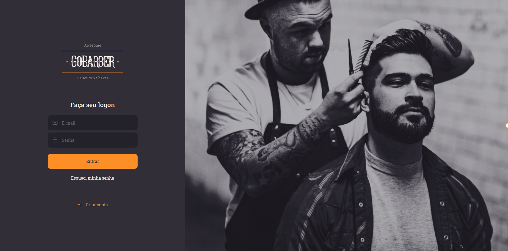

<h1 align="center">
GoBarber Web
</h1>

The web version of the GoBarber app that is used by users who provide services within the app

  

  

## 📋 Features

- **React Js** — A JavaScript library for building user interfaces
- **Styled Components** — A React library to style components
- **Yup**  — A JavaScript schema builder for value parsing and validation
- **React Spring** - A spring-physics based animation library
- **Polished** - A lightweight toolset for writing styles in JavaScript
- **Unform** - A performance focused library to create forms in React

## 🚀 Getting started with the app

1. Clone this repo using `git clone https://github.com/victor3r/gobarber-web.git`
2. Move yourself to the appropriate directory: `cd gobarber-web` 
3. Run `yarn` to install dependencies 
4. Run `yarn start` to start the web app

## 📝 License

This project is licensed under the MIT License - see the [LICENSE](https://opensource.org/licenses/MIT) page for details.
